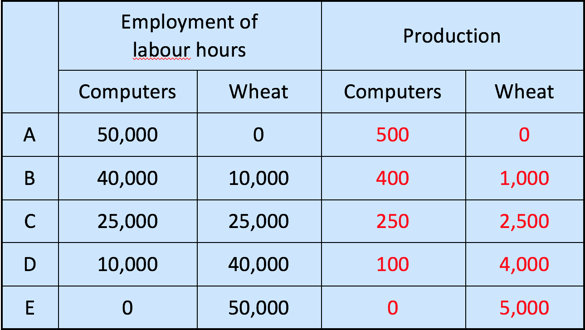
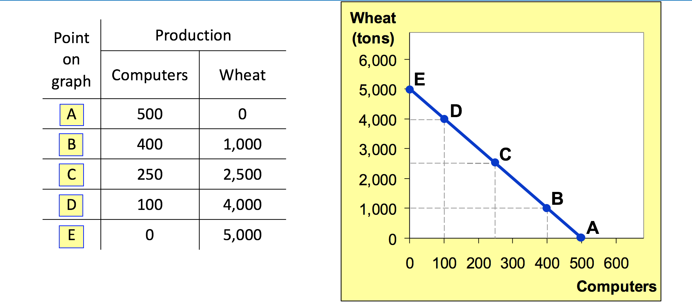

# Economics Methods

## Topics Covered

* Assumptions and Models
* Circular-Flow Diagram
* **Production Possibilities Frontier**
* Positive Analysis and Normative Analysis
* Disagreement among Economists

## Two Roles Played by Economists

**Economists play two roles**

1. *Scientists*: try to explain the world
2. *Policy Advisors*: try to improve the situation

* As scientists, economists make **positive** statements
* As policy advisors, economists make normative statements.
* We will learn positive and normative analysis later in this chapter.

## The Scientific Method: Observations, Theory, and More Observation

### Assumptions & Models

* Economic Models are built on Assumptions

> When studying gains from trade, we assume the economy consists of two people and two goods.

### First example: Circular-Flow Diagram

**Circular flow diagram**: a visual model of the economy that shows how dollars flow through markets among households and firms.

* A representative firm and a representative household interact each other in two markets: Markets for goods and services and Markets for factors or productions

### PPF

**Production possibilities frontier**: a graph that shows the combinations of output that an economy can possibly produce given the available factors of production and the available technology

#### Assumptions

* Two goods: computers and wheat
* One resource: labour
* Economy has 50,000 labour hours per month available for production.

#### Example

* Economy has 50,000 labour hours per month available for production.
* Producing one computer requires 100 hours labour.
* Producing one ton of wheat requires 10 hours labour

#### The PPF and Opportunity Cost

* Recall: The **opportunity cost** of an item is what must be given up obtain that item.
* Due to limited labour, to produce one more computer, we need to produce less wheat.
* **The slope of the PPF tells you the opportunity cost of one good in terms of the other**
  * Here, the opportunity cost of a computer is 10 tons of wheat _for each unit_

#### Economic Growth and the PPF

With addiitonal resources or an improvement in technology, the economy *can produce more computers, more wheat, or any combination in between.*

(A shift in both the `y-axis` and `x-axis`)

#### The Shape of the PPF

* The PPF could be a straight line or bow-shaped.
* Depends on what happens to opportunity cost as economy shifts resources from one industry to the other.
  * If the opportunity cost remains constant, PPF is a straight line. (In the previous example, the opportunity cost of a computer was always 10 tons of wheat.)
  * If the opportunity cost of a good rises as the economy produces more of the good, PPF is bow-shaped.

(See ppt to understand why PPF may be bow-shaped.)

* PPF is bow-shaped when different workers have different skills, different opportunity costs of producing one good in terms of other.
* The PPF would also be bow-shaped when there is another resource, or mix of resources with varying opportunity costs

#### The PPF: A summary

* The PPF shows all combinations of two goods that an economy can possibly produce given the available factors of production and the available technology.
* The PPF illustrates the concepts of scarcity, tradeoff and opportunity cost, efficiency and inefficiency, unemployment, and economic growth.
* A bow-shaped PPF illustrates the concept of increasing opportunity cost.

## Microeconomics and Macroeconomics

* The field of economics is divided into two subfields: microeconomics and macroeconomics.

**Microeconomics** is the study of how households and firms make decisions and how they interact in _one market_.

**Macroecnomics** is the study of economy-wide phenomena, including inflation, unemployment, economic growth, and business cycles

## Positive Analysis vs. Normative Analysis

**Positive statements** are claims that attempt to describe the world as it is.

**Normative statements** are claims that attempt to prescribe how the world should be.

### Positive Analysis vs. Normative Analysis: An example

The following two statements are about rent controls

1. Rent controls reduce the quantity and quality of housing available. (_positive_)
2. The government should place rent controls (_normative_)

## Why Economists Disagree?

* **Differences in scientific judgements (positive)** -
Economists sometimes disagree about the validity of alternative positive theories about how the world works.
* **Differences in values (normative)** -
Economists may have different values and, therefore different normative views about what policy should try to accomplish.

## Summary

1. As scientists, economists try to explain the world using models with appropriate assumptions. As policy advisers, economists offer advice on how to improve the world.
2. Assumptions simplify the complicated world and make it easier to understand.
3. Positive statements are claims that attempt to describe the world as it is. Normative statements are claims that attempt to prescribe how the world should be.
4. Economists disagree because of differences in scientific judgments or because of differences in values.
