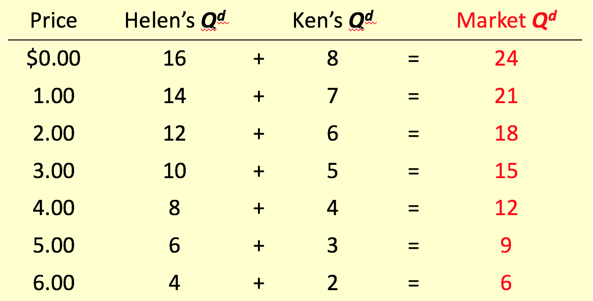
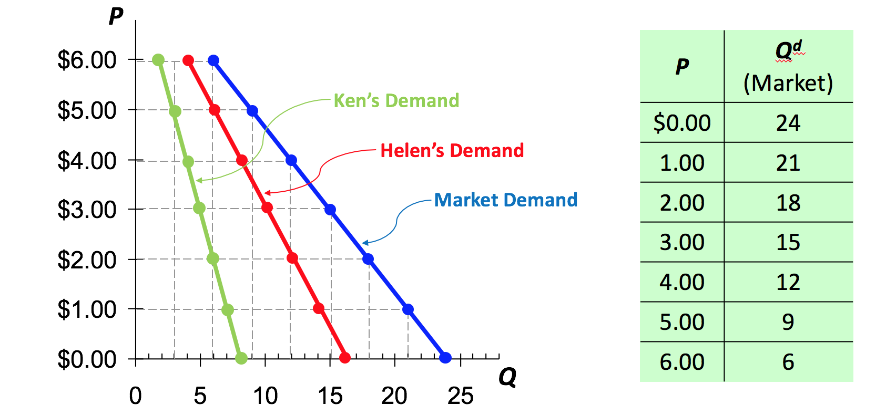
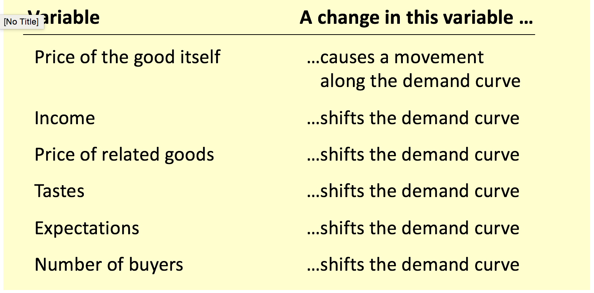
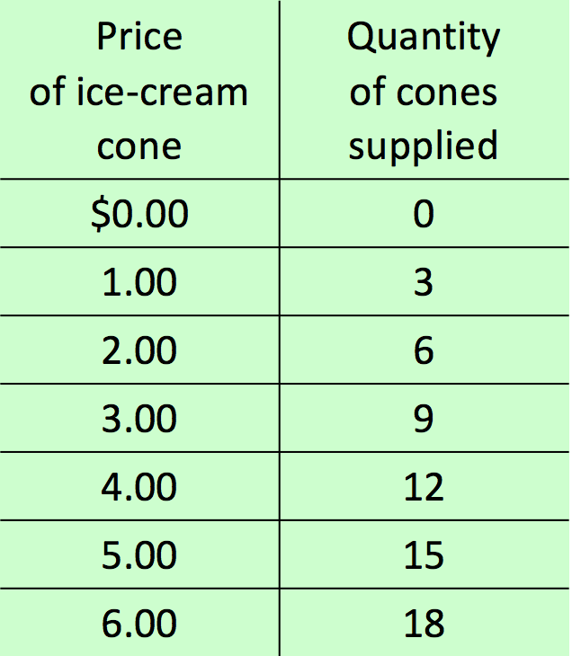
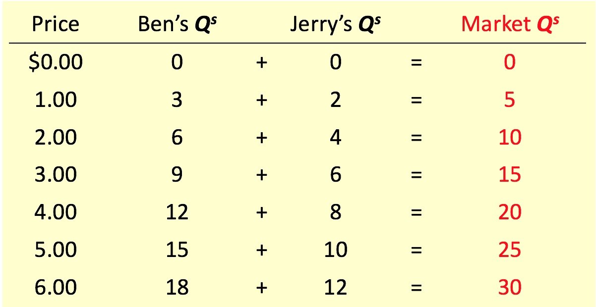

# Demand and Supply

## Topics

* Competitive Market
* Demand
* Supply
* How supply and demand together

### Some words before we start

* This chapter is a "bird-eye view", aiming to explain increase/decrease of price or quantity in a market in an easy way.
* If you're a skeptic, you will learn some reasons behind consumers and producers in the market later in this course.

## Markets and Competition

**Markets**: a group of buyers and sellers of a particular good or service.

**Competitive market**: a market in which there are many buyers and many sellers so that each has a negligible impact on the market price.

In a perfectly competitive market:

* All goods are exactly the same
* Buyers and sellers are so numerous that no one can affect market price - each is a *price taker*.
* Free entry to and free exit from the market.

## Markets and Competition

Example of competitive market: wheat market.

A whole spectrum of markets:
* **Competitive Market**: Many sellers + homogeneous goods
* **Monopoly Market**: One seller
* **Oligopoly**: Few sellers
* **Monopolistic Competition**: Many sellers  heterogeneous goods

## Demand

**Demand** the relationship between **price of a good ** and **quantity demanded**, *given other things being equal*.

* This is a crude definition, but sufficient for this chapter.
* You will learn more in details about its economic interpretation and from where it comes later in chapter 7 of the textbook.

**Quantity demanded**: the amount of a good that buyers are willing and able to purchase.

**Law of demand** other things qual, the *quantity demanded* of a good falls when the *price* of the good rises.

## Market Demand vs. Individual Demand

* The quantity demanded in the market is the sum of the quantities demanded by all buyers *at each price*

* Suppose Helen and Ken are the only two buyers in the ice cream market.

## Shifts in the Demand Curve

* **Increase in demand**: any change that increases the quantity demanded at *each level of price*.

* **Decrease in demand**: any change that reduces the quantity demanded at *each level of price*.

## Variables that Shift the Demand Curve

* Anything that affects quantity demanded, except the price of its own good, and shift demand. Including...
  * Income
  * Prices of Related Goods
  * Tastes
  * Expectations
  * Number of Buyers
  * Etc…..

### Income

The relation ship between income and quantity demanded depends on what type of good the product is.

**Normal good**: a good for which, other things equal, an increase in income leads to an increase in demand.

**Inferior good**: a good for which, other things equal, an increase in income leads to a decrease in demand.

### Prices of Related goods

> **Scenario 1**: Suppose you were to went to *Sushi California* for salmon sashimi and you found that the price of salmon sashimi became $12 instead of $9, while other food prices stayed the same. Would you have changed your mind? How?

> **Scenario 2**: You were to went to IKEA. You got a 50% off on a lamp of your choice and you decided to buy it. Would IKEA has successfully "trapped" you to buy something else?

* **Substitutes**: two goods for which an increase in the price of one good leads to an increase in the demand for the other.

* **Complements**: two goods for which an increase in the price of one good leads to a decrease in the demand for the other.

*Can you give me several examples of substitutes?*

### Tastes

### Expectations

As the expected price decreases tomorrow, demand falls today

### Number of buyers

As number of buyers increases, market demand will increase.

## Change in Demand vs. Change in Quantity Demanded

Change in its own price -> Change in quantity demanded
Change in other variables -> Change in demand

## Application: Two Ways to Reduce the Quantity of Smoking Demanded

Two ways to reduce the quantity of smoking demanded

1. **Shift the demand curve for cigarettes to the left.** Public service announcements, mandatory health warnings on cigarette packages, and the prohibition of cigarette advertising on TV.

2. **Raise the price of cigarettes by increasing tobacco or cigarette tax.**

## Supply

**Supply**: the relationship between **price of a good** and **quantity supplied**, given other things being equal.

* Again, this is a crude definition, but sufficient for this chapter.
* You will learn more in details about its economic interpretation and from where it comes later in chapter 14 of the textbook.

**Quantity supplied** the amount of a good that sellers are willing and able to sell.

**Law of supply** other things equal, the quantity supplied of a good rises when the price of the good rises.

## Supply Schedule

* **Supply schedule**: A table that shows the relationship between the price of a good and the quantity supplied, given other things being equal.

## Market Supply vs. Individual Supply

* The quantity supplied in the market is the sum of the quantities supplied by all sellers at each price.

## Shift in Supply Curve

**Increase in supply**: any change that increases the quantity supplied at each level of price. Graphically, it’s a shift of the supply curve to the right.

**Decrease in supply**: any change that reduces the quantity supplied at each level of price. Graphically, it’s a shift of the supply curve to the left.

## Variables that Shift the Supply Curve

* Anything that affects quantity supplied, **except the price of its own good**, can shift supplies. These variables include...

1. Input prices
2. Technology
3. Expectations
4. Number of Sellers

### Input Prices

* Input prices rise -> production becomes less profitable and firms produce less -> decrease in supply
* If input prices rise substantially, a firm might shut down and produce no output at all.

### Technology

* Technological advance -> firms can produce more with the same amount of resource -> increase in supply

> Note
> * In Economics, "technology advance" means a situation in which the same amount of input yields higher amount of output.
> * Technology advance includes not only technical changes, but also unintentional/natural events
> * On the other hand, natural disasters affect supply on the opposite direction.

### Expectations

If the price is expected to rise in the future, firms will put some of its current production into storage and supply less to the market today.

### Number of sellers

As the number of sellers increases, market supply increases.

## Change in Supply vs. Change in Quantity supplied

Change in its own price -> change in quantity supplied
Change in other variables -> change in supply

## Market Equilibrium

**Equilibrium**: a situation in which the price has reached the level where quantity supplied equals quantity demanded.

**Equilibrium price**: the price that balances quantity supplied and quantity demanded.

**Equilibrium quantity**: the quantity supplied and the quantity demanded at the equilibrium price.

## What if the Market is Not in Equilibrium?

**Law of supply and demand**: the price of good adjusts to bring the quantity supplied and the quantity demanded into balance.

## Three Steps to Analyzing Changes in Equilibrium

To determine the effects of any event,

1. Determine whether the even shifts supply curve, or demand curve, or both.
2. Decide in which direction the curve shifts.
3. Use the supply and demand diagram to analyze how the shift changes the equilibrium price and quantity.
